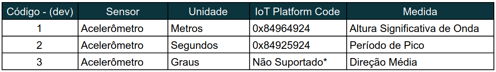

# Testes - LISHA
Repositório de testes para envios e requisições de dados hospedados na plataforma IoT do LISHA.

# Pré-requisitos

Antes de tentar utilizar diretamente quaisquer códigos desse repositório é imprescindível:
- Credenciais de acesso à LISHA's IoT Platform.
- Instalaçãos dos pacotes definidos em requirements.txt.

# Utilização

O conceito de SmartData utilizado pela plataforma do LISHA requer uma manipulação mais cuidadosa dos dados inseridos.
Inicialmente, deve-se ter uma série que comporte e satisfaça o espaço ocupado por esses dados, na criação da série,
é preciso explicitar:
- "version"
- "unit"
- "x","y","z"
- "r"
- "t0","tf"
- "dev"
- "signature"

O ideal é definir coordenadas iniciais relativamente próximas do ponto onde
as boias serão lançadas e um raio absurdamente grande, para evitar que durante a deriva as boias se desloquem para fora do raio definido.

Além disso vale destacar a importância de "signature" e "dev", ambos fornecem informações valiosas especialmente para o tratamento dos dados.

Cada boia oceânica deve ser associada a uma "signature" específica e única, de preferência seguindo um padrão previamente estabelecido, já o "dev" referencia um dispositivo específico da boia, em outras palavras, um sensor, afinal, uma boia pode ter um sensor para medir, salinidade, temperatura, condutividade, entre outras coisas, e, portanto, as unidades de cada sensor são diferentes, assim, também é importante que cada sensor/dispositivo tenha um nome padronizado e único.

Um exemplo de criação de série pode ser encontrado no arquivo ./basics/create_series.py.

Após a criação de uma série já podemos criar os <em>datapoints</em> que serão alocados para essa série. E de maneira semelhante a criação da série devemos apontar um mínimo de "atributos" para que os <em>datapoints</em> sejam criados corretamente. 

Um exemplo de criação de <em>datapoints</em> pode ser encontrado no arquivo ./spotter_data/put_spotter.py. Nele, esses pontos foram criados tendo como base um arquivo .csv (Comma Separated Values) que contém dados de um experimento realizado com uma boia da <em>Sofar Ocean</em>.

Agora, com uma série criada e com dados inseridos dentro dela, podemos partir para a recuperação deles, claro que existem métodos muito mais eficientes e melhor para a visualização, mas se você está apenas engatinhando na utilização das APIs da plataforma ou precisa testar se uma inserção foi feita da forma que esperava, basta realizar um GET passando como parâmetros alguns dos atributos que foram inseridos em outras requisições. Um exemplo de como fazer isso pode ser encontrado no arquivo ./basics/get_data.py.

# Signatures
Signatures já utilizadas:
- '1'
- '"teste1"'
- '2'

# Sensores - "Devices"

<em>Tabela indicando o código interno dos sensores, as unidades de medida e a sua codificação hexadecimal feita pela IoT Platform.</em>

